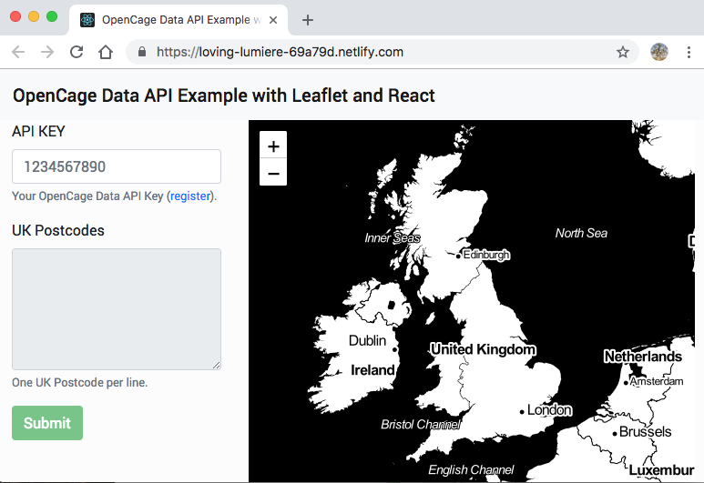

# react-leaflet-opencage

This is my very first app built with [React](https://reactjs.org/) using [LeafletJS](https://leafletjs.com/) and OpenCage Data [Geocoder](https://opencagedata.com/) API.

I did this application for a friend who wanted to display UK Postcodes on a Map.

Visit the [demo](https://loving-lumiere-69a79d.netlify.com/) page.

## Get started

1. clone the repository
1. `$ cd path/to/cloned/repo`
1. `$ yarn` or `$ npm i`

## test

1. `$ yarn test` or `$ npm test`

## run locally

1. `$ yarn start` or `$ npm start`

## build production application

1. `$ yarn build` or `$ npm run build`

## Licensing
Licensed under the MIT License

A copy of the license is available in the repository's [LICENSE](LICENSE.md) file.
